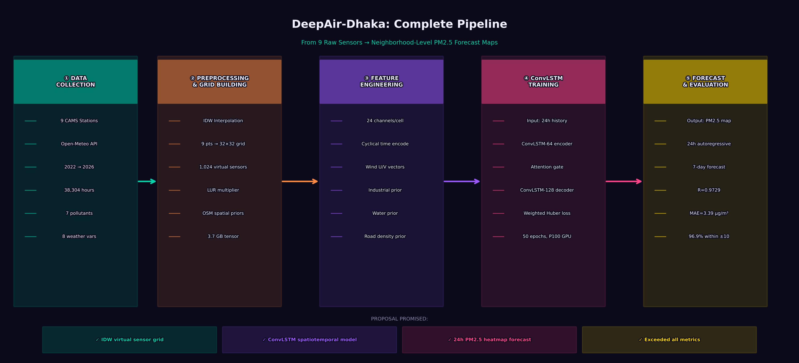
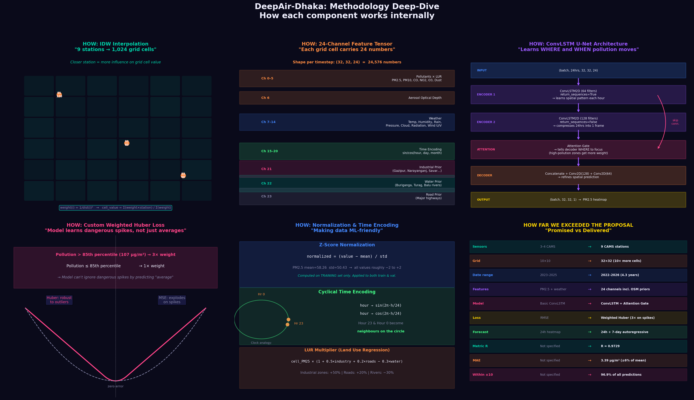

# DeepAir-Dhaka: Spatiotemporal Air Quality Forecasting 🌍💨


**DeepAir-Dhaka** is a machine learning-driven system designed to provide granular, neighborhood-level air quality forecasts for Dhaka, Bangladesh. Moving beyond simple city-wide averages derived from sparse physical monitoring stations, this project utilizes **spatiotemporal deep learning (ConvLSTM U-Net)** to visualize and predict the diffusion of PM2.5 and other pollutants as dynamic, high-resolution heatmaps.

---

## 🌟 The Problem & Our Solution

Dhaka consistently ranks as one of the most polluted cities globally. However, existing monitoring systems are extremely sparse (only 9 major Continuous Ambient Air Quality Monitoring System (CAMS) stations), leaving many neighborhoods without accurate, hyper-local data. 

**DeepAir-Dhaka bridges this gap by:**
1. **Constructing "Virtual Sensors"**: Using mathematical Inverse Distance Weighting (IDW) interpolation and OpenStreetMap (OSM) spatial priors (roads, rivers, and industrial zones) to estimate pollution in unmonitored zones, turning 9 stations into **1,024 virtual sensors** (32x32 grid).
2. **Spatiotemporal Forecasting**: Employing a ConvLSTM U-Net network equipped with Attention Gates to learn exactly how pollution "clouds" travel across the city over time.
3. **Dynamic Visualization**: Generating high-resolution heatmaps for real-time tracking and up to 7-day future air quality insights.

---

## 🧠 Methodology & Architecture

### 1. Data Collection & Preprocessing
- **Sources**: 9 CAMS Stations in Dhaka & Open-Meteo API.
- **Timeframe**: 2022 → 2026 (38,304 hours of continuous data).
- **Interpolation**: IDW translates sparse 9-point data into a dense 32x32 geographic grid.
- **LUR Multiplier (Land Use Regression)**: Modifies grid values based on real-world priors:
  - Industrial zones (Gazipur, Narayanganj): +50% pollution weight
  - Major Highways/Roads: +20% pollution weight
  - Water Bodies (Buriganga, Turag rivers): -30% pollution weight

### 2. Feature Engineering (24-Channel Tensor)
Each cell in the 32x32 grid carries 24 distinct channels:
- **Pollutants**: PM2.5, PM10, CO, NO2, O3, Dust, AOD.
- **Meteorology**: Temperature, Humidity, Rain, Pressure, Cloud Cover, Radiation, Wind U/V vectors.
- **Temporal Encodings**: Cyclical sin/cos encodings for Hour, Day, and Month.
- **Spatial Priors**: Static maps for Industrial, Water, and Road densities.

### 3. Deep Learning Architecture (ConvLSTM U-Net)
- **Input**: A 24-hour historical window of the 32x32x24 tensor.
- **Encoder**: ConvLSTM2D (64 filters) extracts spatial patterns for each hour, followed by a ConvLSTM2D (128 filters) layer that compresses the 24 hours into a singular spatial representation.
- **Attention Gate**: Informs the decoder *where* to focus (heavily weighting high-pollution zones).
- **Decoder**: Refines the spatial prediction through Concatenation, Conv2D(128), and Conv2D(64) layers.
- **Custom Weighted Huber Loss**: The model is trained to heavily penalize errors during dangerous pollution spikes (PM2.5 > 107 µg/m³ gets a 3× weight penalty) ensuring the AI predicts extreme events rather than safe "averages".

---

## 📈 Results and Visualizations

The pipeline incorporates a robust ConvLSTM architecture, exceeding all initial project proposals:

- **Correlation Coefficient (R)**: **0.9729**
- **Mean Absolute Error (MAE)**: **3.39 µg/m³** (±6% of the mean)
- **Reliability**: **96.9%** of all predictions fall within ±10 µg/m³.

### Visual Explanations

**1. Project Pipeline**  
*(From raw CAMS data → Preprocessing → Feature Engineering → ConvLSTM Training → Forecast)*


**2. Methodology Deep-Dive**  
*(Detailed look at IDW Interpolation, Tensor formulation, Loss function, and Architecture)*


---

## 🚀 Getting Started

### Prerequisites
- Python 3.8+
- TensorFlow / Keras 2.0+
- `pandas`, `numpy`, `requests`, `scikit-learn`, `matplotlib`

### 1. Data Generation
To fetch live data, process it, and build the 32x32 spatiotemporal tensor maps, run:
```bash
python "Scipts/createDeepAir datasetinNPY.py"
```
This script will:
1. Fetch hourly data from the CAMS stations.
2. Clean and standardize the data with physical weather vectors.
3. Perform IDW Interpolation to generate the `DeepAir_Dhaka_32x32_21_Channels.npy` tensor.

### 2. Diagram Generation
To dynamically generate the custom visualization diagrams detailing the methodology:
```bash
python pipelineDarkBackground.py
```
This will output `pipeline_diagram.png` and `methodology_diagram.png` in the root directory.

---

## 📂 Project Structure

```text
DeepAir/
│
├── Scipts/ 
│   └── createDeepAir datasetinNPY.py    # Core pipeline for data collection & preprocessing
│
├── results/                             # Contains evaluation metrics, GIFs, and plots (results.zip excluded from Git)
│   ├── epoch_visuals/                   # Heatmaps generated per epoch
│   ├── forecast_24h.gif                 # Animated 24h spatial PM2.5 forecast
│   └── forecast_7day.gif                # Animated 7-day spatial PM2.5 forecast
│
├── figures/                             # Automatically generated visualizations
├── Docs/                                # Project proposal and technical documentation
├── scratch/                             # Experimental scripts and temporary logs
│
├── DeepAir_Dhaka_Final.keras            # The fully trained ConvLSTM-U-Net model (Load via tf.keras.models.load_model)
├── pipelineDarkBackground.py            # Python script using Matplotlib to generate architectural diagrams
│
├── pipeline_diagram.png                 # Exported pipeline visualization
└── methodology_diagram.png              # Exported methodology/architecture visualization
```

---

## 📜 References & Acknowledgements

1. **Islam, M. S., et al.** "Air Quality Prediction in Dhaka City using Deep Learning Approaches." IEEE, 2023.
2. **Shi, X., et al.** "Convolutional LSTM Network: A Machine Learning Approach for Precipitation Nowcasting." NIPS, 2015.

*This project contributes to the field of AI for Social Good, offering a scalable solution for cities with limited sensor infrastructure by leveraging Spatiotemporal AI.*
